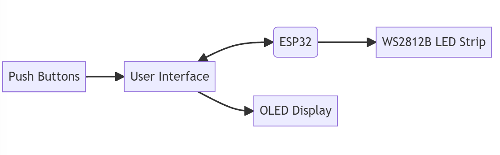

# Pomoduino
Pomoduino is an open-source project based on Arduino and ESP32 that combines the Pomodoro Technique with a customizable timer using LED, push buttons, and an OLED display. The project aims to provide an efficient and visually engaging timer for enhanced productivity and time management.

## Firmware Architecture
Pomoduino Firmware architecture follows the Model-View-Controller (MVC) pattern, separating the user interface (View), data and logic (Model), and user input and control flow (Controller). See more details about system design [here](./doc/system_design.md).
## Hardware Architecture

- User Interface: The user interacts with the Pomoduino through the various hardware components.

- ESP32: The ESP32 microcontroller serves as the main control unit for the Pomoduino. It manages the communication between different hardware components and controls their behavior.

- Push Buttons: The push buttons are used for user input, allowing the user to navigate through menus, adjust settings, and control the timer.

- WS2812B LED Strip: The WS2812B LED strip provides visual feedback by displaying different colors and patterns. It is used to indicate the timer status and session progression.

- OLED Display: The OLED display shows relevant information such as the time remaining, session status, and configuration settings.

This architecture represents the hardware components and their connections within the Pomoduino project. The ESP32 acts as the central control unit, coordinating the interaction between the push buttons, LED strip, and OLED display.

## Features

- Configurable work duration, rest duration, and number of cycles
- Visual indication of the current timer state using the LED
- Time remaining display on the OLED screen
- Navigation buttons for easy control and configuration

## Development Process

The development of Pomoduino followed a typical Software Development Life Cycle (SDLC) process. The project started with the identification of user requirements and was documented in the form of user stories, which served as a basis for creating the System Requirements Specification (SRS) document. The SRS document provided a detailed description of the system functionality and its requirements.

Throughout the development process, the project was planned and managed using agile methodologies, with tasks organized in a Kanban board for better visibility and collaboration. The firmware was designed following a modular architecture, and common software design patterns were utilized to ensure maintainability and extensibility.

## Getting Started

### Prerequisites

- Arduino IDE or PlatformIO installed
- Required libraries:
  - Adafruit GFX Library
  - Adafruit SSD1306

### Installation

1. Clone this repository to your local machine.
2. Open the project in Arduino IDE or PlatformIO.
3. Connect the ESP32, WS2812B LED, push buttons, and OLED display to your Arduino board following the circuit diagram.
4. Compile and upload the sketch to your Arduino board.
5. The Pomoduino timer is now ready to use!

## Usage

1. Power on the Pomoduino.
2. The timer will start with the default settings: 25 minutes of work, 5 minutes of rest, and 4 cycles.
3. The LED will indicate the current timer state: ON for work sessions, OFF for rest sessions.
4. The OLED display will show the time remaining for the current session.
5. Use the navigation buttons to adjust the settings or control the timer as needed.

## Contributing

Contributions to Pomoduino are welcome! If you have any ideas, improvements, or bug fixes, feel free to submit a pull request.

## License

This project is licensed under the [MIT License](LICENSE).

## Acknowledgements

- [Pomodoro Technique](https://francescocirillo.com/pages/pomodoro-technique)

