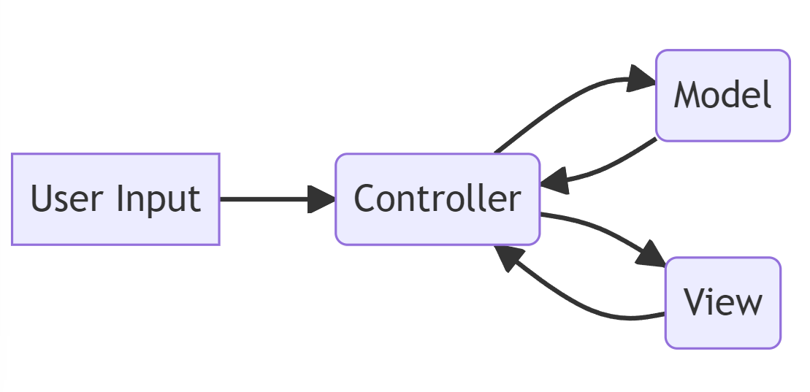
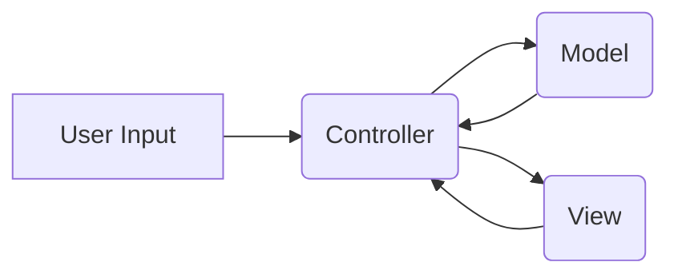

## Firmware Architecture 
The firmware architecture will be based on the Model-View-Controller (MVC) design pattern to separate responsibilities and facilitate code modularity and maintenance. Below, we describe the different parts of the architecture and their justification:

### Model
- Manages the data and core logic of the Pomodoro timer.
- Stores the work duration, rest duration, and cycle settings.
- Tracks the remaining time and current state of the timer.

### View
- Handles the user interface and displays information on the OLED screen.
- Receives updates from the model and shows the remaining time, timer status, and settings.
- Interacts with the user to receive adjustments and commands through the navigation buttons.

### Controller
- Acts as an intermediary between the view and the model, managing control logic and interactions.
- Receives user actions through the navigation buttons and translates them into commands for the model.
- Updates the model based on user actions and communicates the changes to the view for update.

## Design Patterns

### Observer Pattern
- Used to maintain an observer-observable relationship between the model and the view.
- Allows the view to automatically update when there are changes in the model.
- Ensures proper synchronization between the user interface and the timer data.

### State Pattern:
- Used to manage the state of the Pomodoro timer and its different transitions.
- Provides a clear and modular structure to control the application flow based on the current state.
- Facilitates code extensibility and maintenance as new functionalities are added.

Below is a basic block-diagram illustrating the interaction between the components of the architecture:

In this architecture, the user interacts with the User Input, which is handled by the Controller. The Controller updates the Model based on user input and communicates the changes to the View for display. The View also receives updates from the Model and shows the relevant information on the OLED screen.

This firmware architecture provides a structured approach to handle the logic, user interface, and data management of the Pomoduino project, promoting code organization and maintainability.

